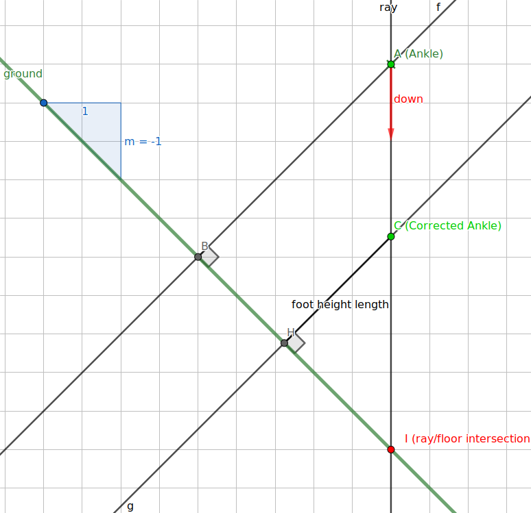

# Ozz-animation sample: Foot IK

## Description

Foot IK, or foot planting, is a technique used to correct character legs and ankles procedurally at runtime, as well as character/pelvis height, so that the feet can touch ground.

## Concept

The core concept is to apply two bone IK to the hip/knee/ankle joint chains of the character so each foot is at the correct height from the ground, and aim IK to the ankle so that it's aligned to the ground. Raycast (from ankle position, directed down to the ground) is used to find the point and normal where each foot should be on ground. Foot height (heel, sole) and slope angle must be considered when computing ankle position, to be sure the orientated foot remains precisely on ground. 
The second important aspect is to adjust character height, so that the lowest foot touches the ground. The over leg(s) will be bent by IK. 

This sample focuses on IK application and core maths. It's not a complete foot planting implementation, as it would require more:
- Activate/deactivate foot planting, blending in and out when feet are not supposed to be on ground, like during walk cycle.
- Detect not reachable foot positions: too high, too low, too steep... and deactivate IK.
- A layer of animation should also be added, to cope with major leg elevation differences. This would allow IK to correct more natural positions.
- ...

## Sample usage

The sample allows to move and rotate the character on the collision mesh, with y value being automatically computed if "auto character height" option is enabled.
Pelvis correction, two bone IK and aim IK can be activated independently.
Debug settings are exposed to help understanding: showing joints, raycasts, IK targets...

## Implementation

1. At initialization time:
   1. Loads skeleton, animation and mesh. See "playback" sample for more details.
   2. Locates hip, knee and ankle joints for each leg, searching them by name.
2. At run time:
   1. Updates base animation and skeleton joints model-space matrices. See "playback" sample for more details.
   2. Estimates character height on the floor, evaluted at its root position.
   3. For each leg, raycasts a vector going down from the ankle position. This allows to find the intersection point (I) with the floor.
   4. Comptutes ankle target position (C), so that the foot is in contact with the floor. Because of floor slope (defined by raycast intersection normal), ankle position cannot be simply be offseted by foot offset. See diagram below.

   6. Offsets the character down, so that the lowest ankle (lowest from its original position) reaches its targetted position. The other leg(s) will be ik-ed.
   7. Applies two bone IK to each leg, so the ankles reache their targetted position. This in computed in character model-space.
   8. Applies aim IK to each ankle, so the footis correctly aligned to the floor. Uses floor normal as a reference to align ankle up vector. The forward direction of the foot is then driven by the pole vector, which polls the foot (ankle forward vector) toward it's original (animated) direction.